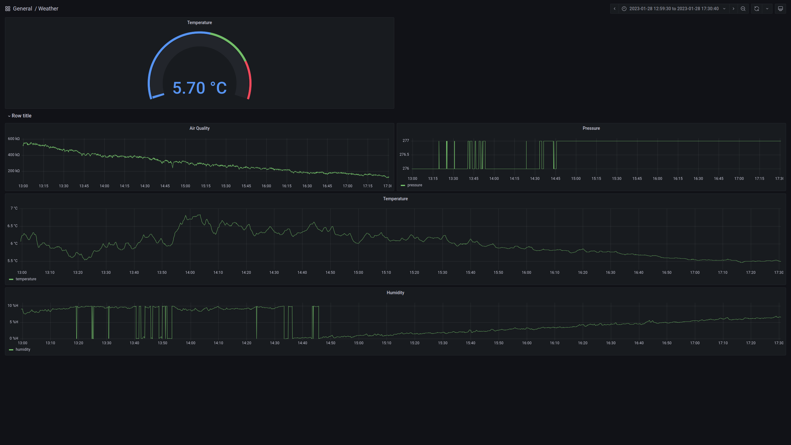

# Weather Station
### BME688 and D1 mini

This code will use a D1 mini connected to a BME688 (or BME 680) sensor to your local Wi-Fi network
and broadcast the sensors readings over your local Wi-Fi network using UDP broadcast packets.

The python script in this will then read that data and input it into a MySQL database ready to be read
into a grafana dashboard.

I used a Raspberry Pi 4 to run grafana.



### BME688 connections to D1 mini

```
D1  ---> BME
3v3 ---> 3v3
GND ---> GND
D1  ---> SCK
D2  ---> SCL
```

#### Uploading Code
Use the Arduino IDE to upload the code to the board.
See this link: https://gist.github.com/carljdp/e6a3f5a11edea63c2c14312b534f4e53 on how to install
the relevant board and upload the code.

### MySQL
Create a MySQL database on a machine on your local network; I installed mariadb on the raspberry pi.

This needs to have a table with the following headings:
```
field           datatype
------------------------
time            DATETIME
temperature     int
pressure        int
humidity        int
gasses          int
```

You'll need to add the username, password, database and table name in the main.py script.
It is recommended that you create a 'read-only' user in the database.

### Grafana
Use the created database to create a grafana dashboard, use the 'read-only' user in your login for that
data.